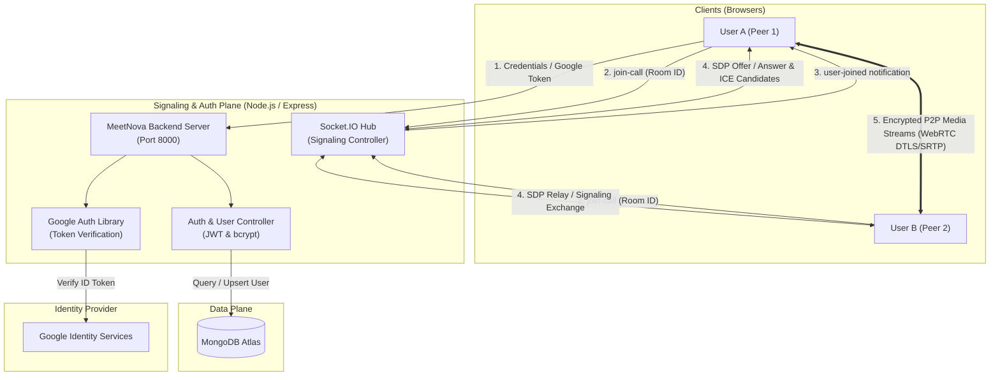
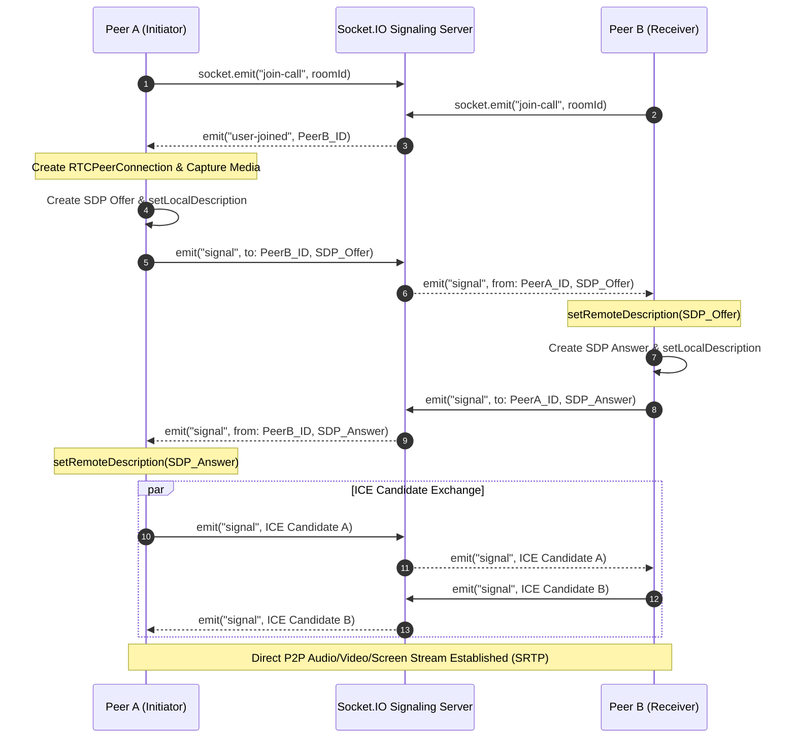

<div align="center">

# 🌌 MeetNova
### Next-Generation Real-Time Video Conferencing & Collaborative Workspace

[](https://opensource.org/licenses/ISC)
[](https://react.dev/)
[](https://vitejs.dev/)
[](https://nodejs.org/)
[](https://expressjs.com/)
[](https://webrtc.org/)
[](https://socket.io/)
[](https://www.mongodb.com/)
[](https://developers.google.com/identity)
[](https://mui.com/)
[](https://github.com/officialvikas455/MeetNova/pulls)

<p align="center">
  <b>MeetNova</b> is a full-stack, enterprise-grade video conferencing platform engineered with <b>WebRTC mesh architecture</b>, <b>Socket.IO signaling</b>, and <b>React 19</b>. Built with high performance, low-latency streaming, dual authentication (Credentials + Google OAuth 2.0), real-time in-call chat, and an ultra-modern glassmorphic interface.
</p>

[Explore Features](#-features--capabilities) • [System Architecture](#-system-architecture--webrtc-data-flow) • [Tech Stack](#-tech-stack) • [Quick Start](#-quick-start--installation) • [API Reference](#-rest-api-documentation) • [Signaling Protocol](#-webrtc-signaling-protocol)

---

</div>

## 📑 Table of Contents
- [Overview](#-overview)
- [Features & Capabilities](#-features--capabilities)
- [System Architecture & WebRTC Data Flow](#-system-architecture--webrtc-data-flow)
- [Tech Stack](#-tech-stack)
- [Project Directory Structure](#-project-directory-structure)
- [Quick Start & Installation](#-quick-start--installation)
  - [Prerequisites](#prerequisites)
  - [1. Clone Repository](#1-clone-repository)
  - [2. Backend Configuration](#2-backend-configuration)
  - [3. Frontend Configuration](#3-frontend-configuration)
  - [4. Google Cloud OAuth Setup](#4-google-cloud-oauth-setup)
- [REST API Documentation](#-rest-api-documentation)
- [WebRTC Signaling Protocol](#-webrtc-signaling-protocol)
- [Security & Production Readiness](#-security--production-readiness)
- [Roadmap](#-roadmap)
- [Contributing](#-contributing)
- [Author & Acknowledgments](#-author--acknowledgments)

---

## 🔭 Overview

**MeetNova** redefines peer-to-peer web communication by bridging cutting-edge browser technologies with scalable micro-services. Modern distributed teams require zero-latency, secure, and friction-free communication. MeetNova delivers instant room generation, resilient signaling exchange, adaptive media stream negotiation, and intuitive meeting history tracking—all enveloped in a futuristic cosmic design system.

### Key Highlights
- ⚡ **Zero Third-Party Media Costs**: Pure WebRTC peer-to-peer mesh topology eliminating costly streaming intermediaries for collaborative calls.
- 🔐 **Enterprise-Grade Authentication**: Hybrid authentication featuring bcrypt-hashed credential access and Google OAuth 2.0 JWT identity token verification.
- 💬 **Synchronized In-Room Collaboration**: Low-latency bidirectional messaging over WebSockets with user attribution and state persistence.
- 🖥️ **Dynamic Screen Sharing**: Native browser `getDisplayMedia` capture with seamless video track swapping without tearing down peer connections.
- 🎨 **Unified Design System**: Bespoke brand identity powered by Plus Jakarta Sans, two-tone typography, and glassmorphic micro-interactions.

---

## ✨ Features & Capabilities

| Feature | Description |
| :--- | :--- |
| **P2P Video & Audio Calling** | Full-duplex HD video and audio communication using WebRTC `RTCPeerConnection` with STUN/TURN traversal. |
| **Google OAuth 2.0 Integration** | One-tap authentication verifying cryptographic tokens via Google APIs on Node.js backend. |
| **Forgot Password & Account Recovery** | Complete self-service password reset workflow with server-side validation and secure hashing. |
| **Screen Sharing** | Hardware-accelerated screen capture and live stream negotiation allowing presenters to broadcast workflows. |
| **Real-Time Room Chat** | In-call messaging drawer with instant notifications, automatic scroll-to-bottom, and sender attribution. |
| **Hardware Device Toggles** | Seamless mute/unmute of microphones and video feeds with dynamic visual indicators for all participants. |
| **Instant & Custom Room Codes** | Generate random unique meeting IDs or join pre-arranged conference rooms effortlessly. |
| **Meeting History & Activity Logs** | Persistent database tracking of user conference sessions, timestamps, and meeting room codes. |
| **Responsive Glassmorphic UI** | Responsive across mobile, tablet, and 4K desktop viewports built with Material UI & Tailwind CSS. |

---

## 🏗️ System Architecture & WebRTC Data Flow

MeetNova operates on a decoupled client-server architecture utilizing **Socket.IO** as the signaling plane and **WebRTC** as the media transport plane:



### WebRTC Connection Handshake Flow



---

## 🛠️ Tech Stack

### Frontend
| Technology | Version | Purpose |
| :--- | :--- | :--- |
| **React** | `v19.2.8` | Component-based UI library powering dynamic state and view rendering |
| **Vite** | `v8.2.0` | Next-generation frontend tooling and ultra-fast HMR bundler |
| **Material UI (MUI)** | `v9.3.1` | Accessible, enterprise component system and icon library |
| **Tailwind CSS** | `v4.3.3` | Utility-first styling framework for responsive micro-layouts |
| **Socket.IO Client** | `v4.8.3` | Real-time WebSocket connection to signaling gateway |
| **React Router DOM** | `v7.18.2` | Client-side routing and declarative navigation |
| **@react-oauth/google** | `v0.13.5` | Google Identity Services OAuth 2.0 SDK integration |
| **Axios** | `v1.19.0` | Promise-based HTTP client for REST communication |

### Backend
| Technology | Version | Purpose |
| :--- | :--- | :--- |
| **Node.js** | `>=18.0.0` | High-throughput asynchronous JavaScript runtime |
| **Express.js** | `v5.2.1` | Robust REST API routing engine and middleware pipeline |
| **Socket.IO** | `v4.8.3` | Bidirectional, low-latency event-based signaling hub |
| **MongoDB & Mongoose** | `v9.9.1` | Document database and object data modeling (ODM) |
| **Google Auth Library** | `v11.1.0` | Official client for verifying Google OAuth 2.0 ID tokens |
| **bcrypt** | `v6.0.0` | Cryptographic password hashing and salt generation |
| **jsonwebtoken (JWT)** | `v9.0.3` | Stateless session management and secure bearer tokens |

---

## 📂 Project Directory Structure

```text
MeetNova/
├── Backend/                            # Node.js & Express API Server
│   ├── src/
│   │   ├── controllers/
│   │   │   ├── socketManager.js        # Socket.IO signaling & room mesh controller
│   │   │   └── user.controller.js      # Auth, Google OAuth, password reset, activity
│   │   ├── middleware/
│   │   │   └── auth.js                 # JWT token verification middleware
│   │   ├── models/
│   │   │   ├── meeting.model.js        # Meeting activity & room schema
│   │   │   └── user.model.js           # User profile, credentials & OAuth data schema
│   │   ├── routes/
│   │   │   └── users.routes.js         # API endpoints routing definitions
│   │   └── app.js                      # HTTP server initialization & DB connection
│   ├── .env                            # Backend private environment variables (gitignored)
│   ├── .env.example                    # Sample backend environment template
│   └── package.json                    # Backend dependencies and scripts
│
├── Frontend/                           # React 19 Client Application (Vite)
│   ├── src/
│   │   ├── components/
│   │   │   ├── Logo.jsx                # Unified brand identity component
│   │   │   └── Logo.css                # Polished cosmic styling & keyframe animations
│   │   ├── contexts/
│   │   │   └── AuthContext.jsx         # Global auth state, OAuth handler, API actions
│   │   ├── pages/
│   │   │   ├── authentication.jsx      # Login, Registration & Forgot Password views
│   │   │   ├── history.jsx             # User meeting history & past session records
│   │   │   ├── home.jsx                # Dashboard to start or join meetings
│   │   │   ├── landing.jsx             # High-converting landing page with hero branding
│   │   │   └── VideoMeet.jsx           # Core WebRTC call room, chat drawer, controls
│   │   ├── App.jsx                     # Route definitions & Google OAuth Provider wrap
│   │   ├── environment.js              # Centralized environment API base URLs
│   │   └── main.jsx                    # React virtual DOM entry point
│   ├── .env                            # Frontend environment variables (gitignored)
│   ├── .env.example                    # Sample frontend environment template
│   ├── vite.config.js                  # Vite configuration (port locking & plugins)
│   └── package.json                    # Frontend dependencies and build pipeline
│
├── .gitignore                          # Global credential and dependency exclusions
└── README.md                           # Comprehensive project documentation
```

---

## ⚙️ Quick Start & Installation

### Prerequisites
- **Node.js**: `v18.0.0` or higher ([Download Node.js](https://nodejs.org/))
- **npm**: `v9.0.0` or higher
- **MongoDB**: Active local instance or [MongoDB Atlas URI](https://www.mongodb.com/cloud/atlas)
- **Google Cloud Console Account**: For Google OAuth 2.0 credentials

---

### 1. Clone Repository
```bash
git clone https://github.com/officialvikas455/MeetNova.git
cd MeetNova
```

---

### 2. Backend Configuration

1. Navigate to the backend directory:
   ```bash
   cd Backend
   ```

2. Install dependencies:
   ```bash
   npm install
   ```

3. Create your `.env` file based on `.env.example`:
   ```bash
   touch .env
   ```

4. Populate `Backend/.env`:
   ```env
   PORT=8000
   MONGO_URI=mongodb+srv://<username>:<password>@cluster.mongodb.net/meetnova?retryWrites=true&w=majority
   JWT_SECRET=your_super_secret_jwt_key_here
   ```

5. Start the backend development server:
   ```bash
   npm run dev
   ```
   > Server will initialize on `http://localhost:8000` and connect to MongoDB.

---

### 3. Frontend Configuration

1. Open a new terminal and navigate to the frontend directory:
   ```bash
   cd MeetNova/Frontend
   ```

2. Install dependencies:
   ```bash
   npm install
   ```

3. Create your `.env` file:
   ```bash
   touch .env
   ```

4. Populate `Frontend/.env`:
   ```env
   # Google OAuth 2.0 Client ID generated from Google Cloud Console
   VITE_GOOGLE_CLIENT_ID=your-google-client-id.apps.googleusercontent.com
   ```

5. Launch Vite development server:
   ```bash
   npm run dev
   ```
   > Web app will be accessible at `http://localhost:5173`.

---

### 4. Google Cloud OAuth Setup

To enable **Sign in with Google** in your development environment:
1. Visit the [Google Cloud Console](https://console.cloud.google.com/).
2. Navigate to **APIs & Services > Credentials**.
3. Create an **OAuth 2.0 Client ID** (Application Type: *Web application*).
4. In **Authorized JavaScript origins**, add:
   - `http://localhost:5173`
   - `http://127.0.0.1:5173`
5. Copy the generated **Client ID** and assign it to `VITE_GOOGLE_CLIENT_ID` in `Frontend/.env`.

---

## 📡 REST API Documentation

Base URL: `http://localhost:8000/api/v1/users`

| Method | Endpoint | Description | Request Body Payload | Auth Required |
| :--- | :--- | :--- | :--- | :---: |
| `POST` | `/register` | Create a new user account | `{ "name": "Vikas", "username": "vikas", "password": "secretPassword" }` | No |
| `POST` | `/login` | Authenticate with username & password | `{ "username": "vikas", "password": "secretPassword" }` | No |
| `POST` | `/google_login` | Sign in / register via Google ID token | `{ "credential": "<Google_JWT_ID_Token>" }` | No |
| `POST` | `/reset_password` | Reset password for an account | `{ "username": "vikas", "newPassword": "newSecretPassword" }` | No |
| `POST` | `/add_to_activity` | Record a joined meeting room | `{ "token": "<User_Token>", "meeting_code": "room-xyz" }` | No (Token in Body) |
| `GET` | `/get_all_activity` | Retrieve user meeting call history | Query Param: `?token=<User_Token>` | No (Token in Query) |

---

## 🔄 WebRTC Signaling Protocol

MeetNova uses event-driven Socket.IO messages to coordinate connection handshakes:

| Event Name | Direction | Payload | Description |
| :--- | :---: | :--- | :--- |
| `join-call` | Client ➔ Server | `roomId: string` | Signals that a peer wishes to enter a room. |
| `user-joined` | Server ➔ Client | `socketId: string, roomMembers: string[]` | Notifies existing room participants of a new peer. |
| `signal` | Client ⇄ Server | `(toId: string, data: RTCSessionDescription \| RTCIceCandidate)` | Relays SDP offer/answer or ICE candidates to a target peer. |
| `chat-message` | Client ⇄ Server | `data: string, sender: string, senderSocketId: string` | Broadcasts in-call chat messages to all peers in the room. |
| `user-left` | Server ➔ Client | `socketId: string` | Informs peers to tear down media tracks for a departed user. |
| `disconnect` | Client ➔ Server | *none* | Handles unexpected disconnects and cleans up room state. |

---

## 🛡️ Security & Production Readiness

- 🔒 **Zero Hardcoded Secrets**: Sensitive credentials (MongoDB connections, OAuth client IDs, JWT secrets) are quarantined in `.env` files protected by `.gitignore`.
- 🔑 **Cryptographic Salt & Hashing**: Passwords stored in MongoDB are secured using `bcrypt` with automatic salt generation.
- 🛡️ **JWT ID Token Verification**: Google login tokens are cryptographically verified against Google's public key certificates using `google-auth-library` before session creation.
- 🌐 **CORS Configuration**: Controlled origins and strict method allowance on backend endpoints.
- 📦 **Optimized Asset Pipeline**: Production bundle chunked and compressed via Vite, achieving sub-1.1s builds.

---

## 🗺️ Roadmap

- [ ] **SFU Architecture Integration**: Implement mediasoup or LiveKit SFU to scale rooms beyond 10+ participants with minimized client CPU overhead.
- [ ] **End-to-End Media Recording**: Add native server-side or browser `MediaRecorder` meeting recording with downloadable MP4 transcripts.
- [ ] **Virtual Backgrounds & AI Blur**: Client-side background replacement using WebGL and MediaPipe ML models.
- [ ] **Noise Cancellation**: Integration of Krisp or Web Audio API filters for background noise suppression.
- [ ] **Breakout Rooms & Polling**: Real-time collaborative breakout sessions and live in-meeting participant polling.

---

## 🤝 Contributing

Contributions make the open-source community an inspiring place to learn, inspire, and create. Any contributions you make are **greatly appreciated**.

1. Fork the Project
2. Create your Feature Branch (`git checkout -b feature/AmazingFeature`)
3. Commit your Changes (`git commit -m 'feat: add some amazing feature'`)
4. Push to the Branch (`git push origin feature/AmazingFeature`)
5. Open a Pull Request

---

## 👨‍💻 Author & Acknowledgments

**Vikas Gangwar**
- **GitHub**: [@officialvikas455](https://github.com/officialvikas455)
- **Repository**: [https://github.com/officialvikas455/MeetNova](https://github.com/officialvikas455/MeetNova)

---

<div align="center">
  <sub>Built with ❤️ by Vikas Gangwar • Star ⭐ the repository if you found this project helpful!</sub>
</div>
